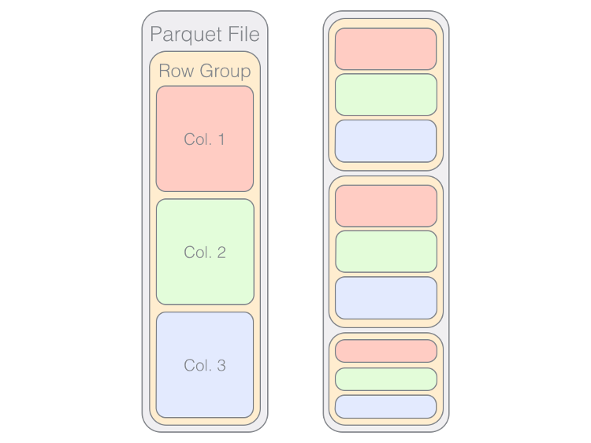

### What is parquet ?

Parquet is a data format widely used in Hadoop ecosystem. It is also compatiable with Amazon Redshift, [Google BigQuery](https://cloud.google.com/bigquery) and [Google Dataproc](https://cloud.google.com/dataproc).

It is a binary format and encoded in a columnar storage. It is compressed and acessible to APIs for Hadoop/ C++

### Why is parquet ? 

Short answer, better performance.

Of course, row-based data fromat like csv, txt can provide high flexibility, however, it comes with a cost of efficiency. On the other hand, when it comes to large amount of data, pure columnar data format requires going through large physical memory in order to get the other desired columns which are far away from the beginning.

Therefore, parquet, as a hybrid solution, is designed for efficiency of querying data without losing flexiblity a row-based data format can provide.

### Other resources

+ [What is Parquet ?](https://databricks.com/glossary/what-is-parquet)

+ Video: [Spark + Parquet in Depth](https://www.youtube.com/watch?v=_0Wpwj_gvzg&t=1513s&ab_channel=SparkSummit)

+ Video: Databricks [The Parquet Format and Optimization Oppurtunity](https://www.youtube.com/watch?v=1j8SdS7s_NY&t=2085s&ab_channel=Databricks)